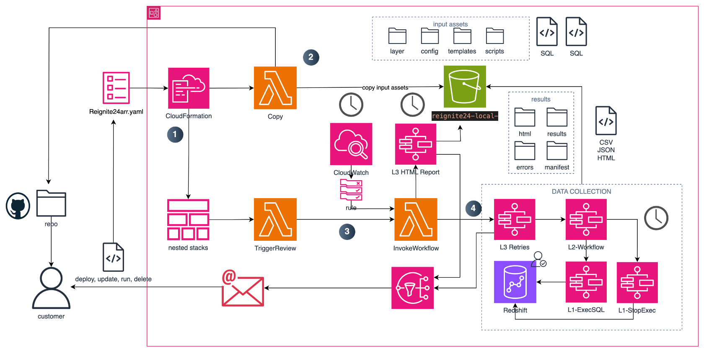
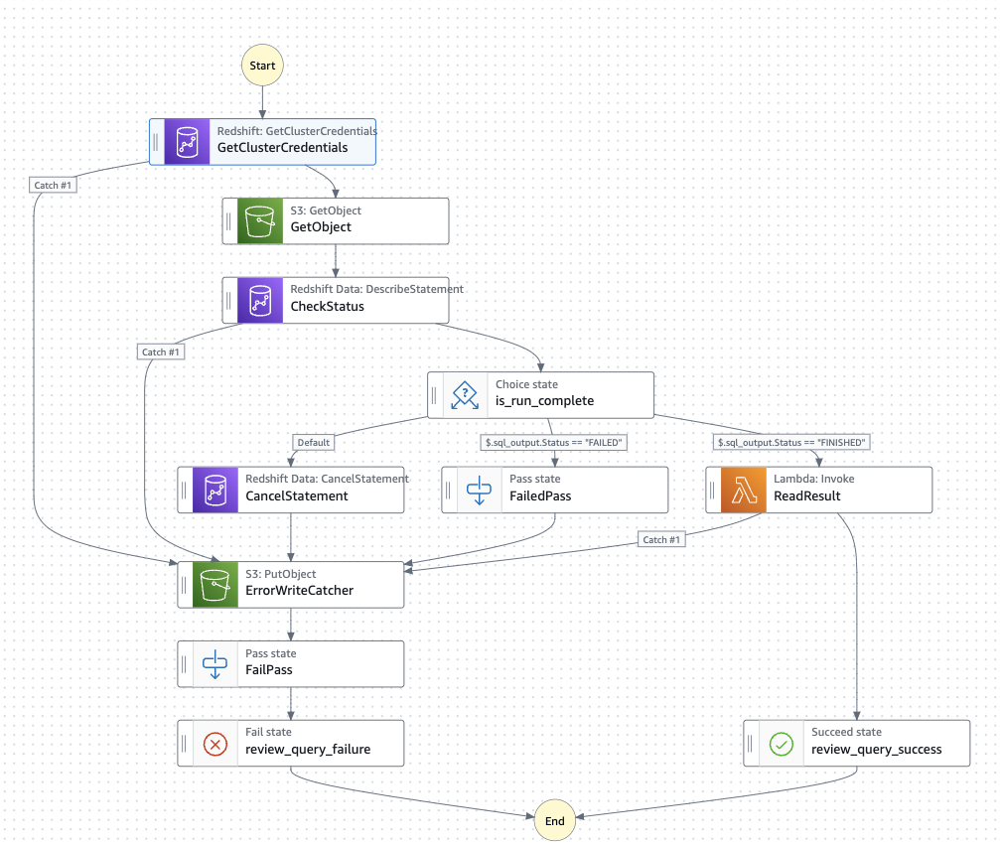
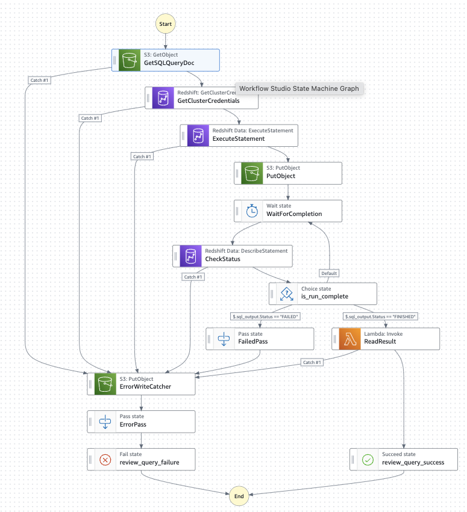
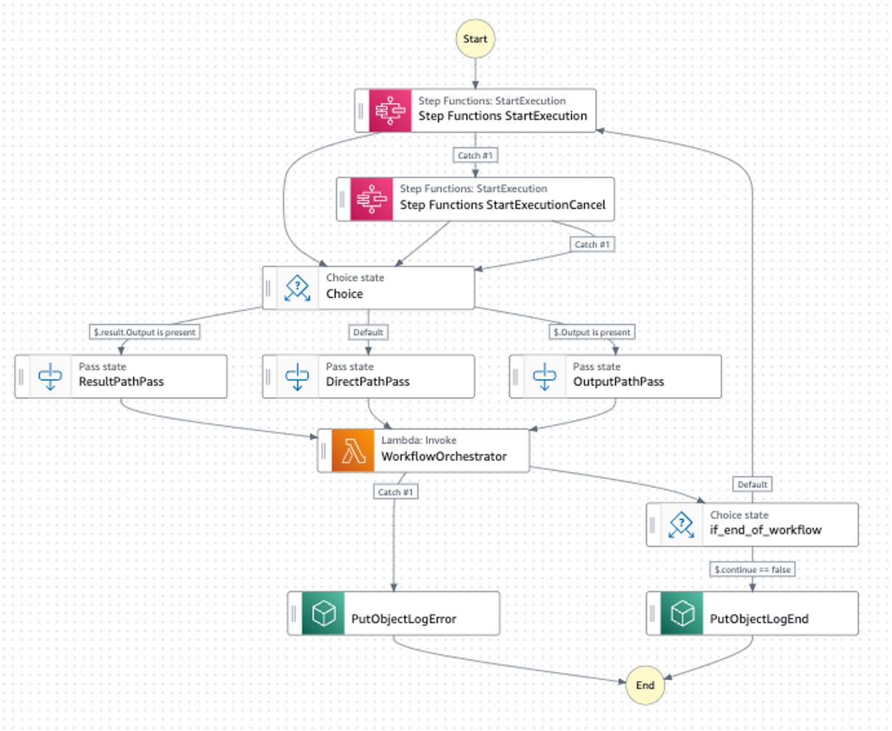
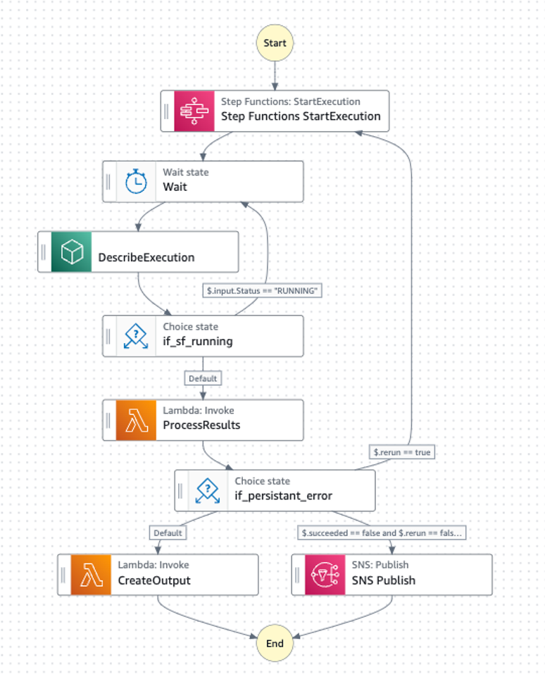
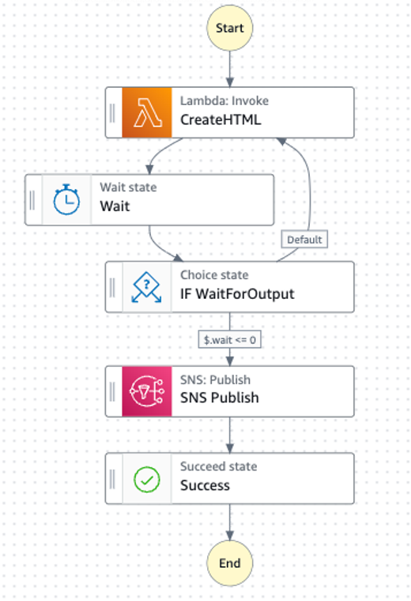

>>>>THIS LINK DOES NOT WORK FOR ALL - It needs to be customized for a GLOBAL bucket >>>>>

# Automated Redshift Review Data Collection with Amazon Redshift Data API and AWS Step Functions

## Requirements

- Implement flexible and configurable workflow execution
- A new SQL query can be included in the workflow, without changing the code, only by updating the configuration files
- The execution of the workflow can be triggered by a custom resource or by an Amazon CloudWatch rule
- The execution of the workflow can be monitored in real time
- The execution of the workflow can be stopped after a certain time
- The execution of the workflow is retried in case of failure , up to a certain number of retries
- The results of the workflow are stored in the S3 bucket in the JSON format, and in the CVS format
- The results of the workflow are used to create a final report in the HTML format
- The user is notified by email in case of persistent errors, or when the execution of the workflow is finished and report is created
- Multiple workflows can be executed in parallel
- The solution is deployed with the AWS CloudFormation service
- Multiple reports can be created on the same infrastructure, the data is stored in the S3 bucket in the separate folders, under the prefix that contains the timestamp of the execution of the workflow

## Open Action Points

- More extensively verify error handling 
- Store the global state in the S3 bucket, and carry it as a reference in the AWS Step Functions 
- Add CI/CD pipeline
- Add tests
- Convert to CDK (easy with migration tool)
- ...

## Architecture

The high level architecture of this solution is presented in Figure 1.
The code base is comprises of the AWS CloudFormation templates, configuration files, SQL scripts, and the level zip file.

The infrastructure is structured in a number of nested stacks. The main stack is the `Reignite24arr.yaml` template.
The stack description includes two custom resources implemented with AWS Lambdas, where one custom resource copies assets from the global S3 bucket to the local S3 bucket and the other custom triggers the execution of the review. The review can also be triggered via the Amazon CloudWatch rule, which is also included in one of the nested stacks. 

The local assets are the configuration files and the SQL scripts. The level is created from the zip file which contains libraries necessary for the creation of the final report in the HTML format.

The configuration files describe the SQL queries that will be executed, ant the HTML template, and the information used to create the review, the conditions, the recommendations, the signals.

The deployment of the solution is done with the AWS CloudFormation service.

Figure 1. High Level Architecture of the Solution

## Pre-requisites 

- In the Amazon Redshift cluster / database,  a user must already be created. This user **must** be a superuser, otherwise some queries will fail. 
this can be done with the following SQL command:

`
CREATE USER data_user CREATEUSER PASSWORD 'xxxxxxx';
`
The password of the user is not used in the solution. The user will be assigned a temporary password when redshift:getClusterCredentials is executed. 

- There is an existing global S3 bucket that stores the assets for the solution. The assets are already in the repo under the folders: level, config, scripts, templates. The same folder structure should be replicated in the S3 bucket.

## The Invoke Workflow Lambda Function

The Invoke Workflow Lambda Function is responsible for creating a data structure that will drive of the review. The Lambda function is triggered by the Custom Resource lambda or by the Amazon CloudWatch rule. 

This lambda reads the workflow config file (config.json) which describes in which order the SQL queries are executed. The execution can be all serial, all parallel, or a combination of both. The Lambda function creates a global state which is used by the AWS Step Functions service to orchestrate the execution of the SQL queries. The global state is at the moment forwarded directly but can also be stored in the S3 bucket. If there are parallel executions the lambda will create a data structure for each of the executions. Accordingly, the lambda will trigger all parallel executions of the AWS Step Functions state machines.

The configuration for each query is comprised of following:

Query:

- name : the name of the query (e.g NodeDetails)
- script key : the key under which the SQL script is stored in the S3 local bucket
- result key : the key under which the results of the query are to be stored in the S3 local bucket
- time threshold : the max time of execution of the query
- error key :  the key under which the error message is to be stored in the S3 local bucket
- status : INITAL | FINISHED | FAILED
- timestamp : the start time for the whole workflow

Additional parameters are used internally by the Lambda function to control the execution of the workflow.

## The AWS StepFunction State Machines
The gathering of the data from the Amazon Redshift cluster is done by the AWS Step Functions service. The state machine is implemented in three levels.

At the lowest level (L1) the state machine uses API interfaces to Amazon Redshift (Data API) At this level the state machine is responsible for the execution of one SQL query. The execution is monitored for errors, and the results of the query are stored in the S3 bucket in the original JSON Format.

The state machine is presented in Figure 2.

Figure 2. State Machine Level-1 : Single SQl Query

At this level, an additional AWS StepFunctions state machine handles the error case when the execution time of the query exceeds the limit for this query. In this case the execution of SFL1 will fail, and SFL1-Error shall assure that the query is stopped, or if the query already finished, the correct state is acknowledged.  The state machine is presented in Figure 3.

Figure 3. State Machine Level-1 : Single SQl Query Error

At the second level (level 2) the state machine implements a loop in which the queries are executed one after another. This loop is orchestrated by means of a global state which contains the inputs for each SQL query in the workflow. The state machine is presented in Figure 4. 
The execution starts with executing the SFL1 for the first query. This execution is time constrained. The execution fails if the time limit is exceeded or if there is problem in the execution. In case of the failure the SFL1-Error is executed. In sase of the success the global state is updated with the results of the query. More specifically, the Lambda function in the state machine is used to process the workflow state as it progresses during the execution of the state machine. This Lambda function identifies which states are in the INITIAL state and starts their execution one after another When the query is executed the Lambda function updates the global state with FAILED or FINISHED and the state machine continues with the next query. The state machine is presented in Figure 4.

Figure 4. State Machine Level-2  The SQL Query Loop

At the highest level (level 3) the state machine is responsible for triggering the execution of the state machines from the level 2. This state machine is responsible for retires. That means the global state  created after the execution of the SF at level 2  is checked for the FAILED states. If there are any retries a new global state is created for execution of the failed states. Whenever the SF at L2 finishes a manifest json file is stored in S3. At L3  the Lambda checks for the number of different manifests - the retry rounds and if the number of manifests is equal or greater to 3 the state machine is stopped and the user is notified with an email about the persistent errors and the list of queries that did not succeed. In case of a success the collected data is transformed from JSON format into CVS format. In this way the data can be accessed and integrated in the final report. The state machine is presented in Figure 3.

Figure 5. State Machine Level-3 : Retry Mechanism

At the level 3 the additional state machine is responsible for creating the final report. This functionality is separated to handle the workflow with parallel executions. The state machine is presented in Figure 6.

Figure 5. State Machine Level-3 : The Final Report Creation

The state machines at the level 3 are triggered by a Lambda Function that creates the initial global state. The Lambda function is triggered by the Custom Resource Lambda function or by the Amazon CloudWatch rule. The Lambda function reads the configuration file and creates the global state for the execution of the state machines at the level 3. The Lambda function is presented in Figure 1.

