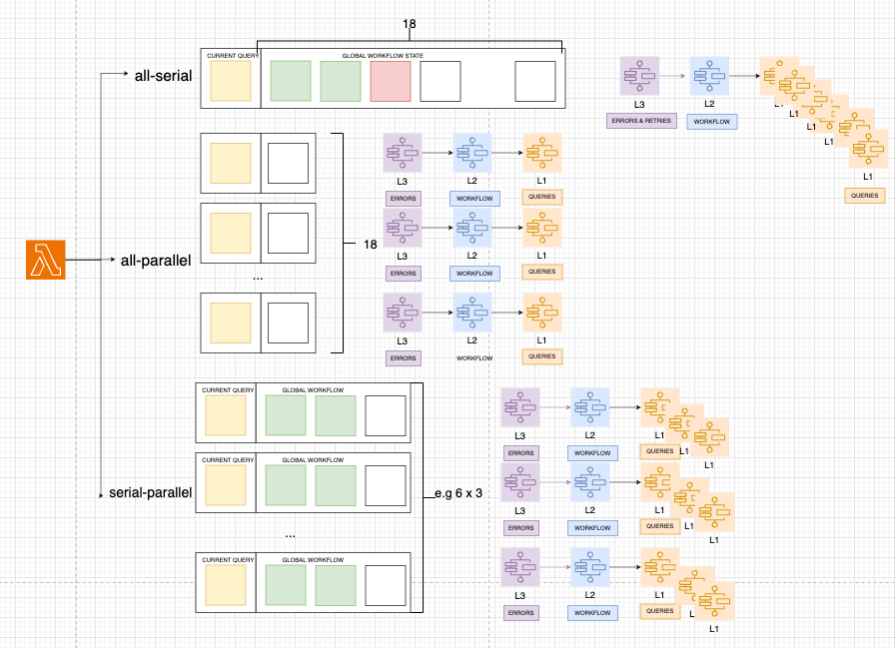

## config.json

The config.json file in this folder is used to describe how the queries will be executed. The file is a JSON object and the keys are the names for different configuratons. The configuration can be selected during the deployment of the CloudFormation template.

The configurations are as follows:

* all-serial :  This stands for the configuration where all the queries are executed serially. The names of the queries are in the order in which they will be executed.  They are all included in one coma separated string, which is the only one element of the array. The query names is paired with the timeout for the query in seconds in a format name:timeout. The timeout is mandatory.

* all-parallel : This stands for the configuration where all the queries are executed in parallel. The names of the queries are in the order in which they will be executed.  They are all separate strings in an array. The query names is paired with the timeout for the query in seconds in a format name:timeout.The timeout is mandatory.

* serial parallel : This stands for the configuration where there is a number of active parallel connections to the database. On each of the connections a number of queries are executed serially. The names of the queries are in the order in which they will be executed.  Here we have as many comma separated strings as there are parallel connections in an array. The query names is paired with the timeout for the query in seconds in a format name:timeout.The timeout is mandatory.

Figure 1: config.json : Configuration Options

As shown in the Figure 1, config.json is used as template by the lambda that triggers the execution of parallel executions. Each parallel execution receives its own state - the list of queries that will be executed one after another.

THe lambda triggers the  execution of the L3 state machine which is responsible for verification and retries. L3 state machine triggers the L2 state machine which is responsible for triggering in the sequence the execution of the L1 state machine according to the global configuration. The L3 state machine executes the query in the asynchronous way.

